# !Human

# **GDD**

| Genero | Público | Modos de juego | Plataforma |
|:-------|:--------|:---------------|:-----------|
| Acción, Rol | Jóven(12 - 30)    |1 Jugador| PC  

### Descripción
!Human es un juego en 2D que mezcla componentes de rol (elaboración de objetos) con la acción directa, que se ubica temporalmente unos cuantos miles de años más tarde de nuestra era.  En él, debemos avanzar por distintas zonas con distintos personajes jugables, máquinas electrónicas que poseen una IA muy desarrollada. En dichas zonas, debemos derrotar a los enemigos y conseguir recursos para ayudar a nuestro personaje principal, Toasty, en su misión para volver a la estación espacial de la que ha caído por error a la Tierra y volver junto con su compañero humano "Collin McGuffin", un astronauta residente en la estación. Sin embargo, Toasty pronto se dará cuenta que no todo continúa como cuando el dejó el planeta.
### Portada
portada del juego

### Historia
Año 16DB, Estacion espacial **Shuppatsu** un asteroide colisiona contra la estacion provocando el desprendimiento de uno de los módulos, el cual se precipita sobre la Tierra.
Al estrellarse sobre la superficie terrestre en una pradera, aparece entre el humo una tostadora, que debido al impacto se ha encendido.
Ésta tostadora fue una de las primeras de su especie, los Companion Devices, también conocidos como CD. Aparatos electrónicos corrientes con una avanzada inteligencia artificial que emulaban emociones. Debido a la complejidad de dicha inteligencia artificial los diseñadores debí­an dividirlas en dos módulos.
Por un lado el módulo de IA **m-4N** que estaba diseñado para poder desarrollar una inteligencia emocional, emulación de emociones y comunicación con humanos progresiva simulando la compañía humana y por otro lado el módulo **g-0D** que es el encargado de las respuestas motoras y control sobre el aparato en sí.

Pero llegado un momento, la gran cantidad de CDs sobre la tierra sumada a la escasez energética que esta sufría ocasiona la retirada de servicio de los CDs, cuyo gasto energético es muy alto. Durante esta retirada, en la estación espacial, el astronauta Collin McGuffin decide esconder a su amigo Toasty en un modulo de rescate para que no se lo llevaran con la promesa de volver a encenderlo cuando todo pasara. Ese es el último recuerdo de nuestro personaje, justo antes de despertarse desorientado en la superficie de la tierra, sin saber que hacer.

Para conseguir las piezas necesarias para llegar de nuevo a la estación espacial y reencontrarse con su amigo, Toasty deberá abrirse paso a través de una tierra poco parecida a la que le había descrito Collin, repleta de CDs malignos que intentarán robar su energía. Pero ésto no lo hará sólo, pues durante su viaje se le unirán amigos que, igual que él, buscan sobrevivir en un mundo desolado y violento.

### 5 Primeros minutos del Juego
Durante los primeros momentos del juego, se realiza una especie de tutorial en la que el jugador va aprendiendo poco a poco las mecánicas básicas: movimiento, ataque, recolección de items, construcción, etc.
Al iniciar el tutorial, el jugador aparece con Toasty en medio de un lugar inhóspito. Se le muestra un primer mensaje que muestra como mover a Toasty. A medida que avanza por el nivel, se le irá dando instrucciones básicas para que se familiarice con el gameplay del juego: movimiento, ataque, objetos... A mitad del nivel, aparecerá el primer enemigo, un perseguidor. Con él, el jugador pondrá en práctica las mecánicas enseñadas anteriormente. A continuación, el jugador volverá a toparse con una serie de enemigos diferentes al perseguidor. Momentos antes de llegar al fin del nivel, el jugador se encuentra con un objeto junto con un mensaje que informa al jugador sobre el sistema de almacenamiento de objetos durante el juego. Finalmente, el jugador saldrá del nivel y será llevado a la Base.
Éste es el lugar en el que se administran todos los aspectos del juego, y para ello cada objeto interactivo en la base contiene una descripción que provee de conocimientos al jugador para que sepa utilizar todos ellos.  

### Jugabilidad
Para poder explicar correctamente este apartado del juego, vamos a dividirlo en varios aspectos.
#### Mecánica
##### Movimiento
Movimiento en 8 direcciones con las teclas WASD. La velocidad de desplazamiento dependerá del atributo correspondiente del personaje.
##### Ataque
En cuanto al ataque, se ejecuta con las teclas de dirección. Existen varias formas de ataque que dependen del personaje jugable que hayamos seleccionado para jugar:

- Ataque a melee: ataque a corta distancia que puede realizarse en 4 direcciones. Su rango dependerá del personaje seleccionado.

- Ataque a distancia: el personaje lanza proyectiles que recorren el nivel hasta impactar con algo o llegar a su máximo rango, que dependerá de los atributos del personaje.
##### Creación de objetos
Durante el juego, iremos recogiendo objetos que se almacenarán en nuestro inventario. Para abrir el inventario y observar los materiales que hemos recogido hasta el momento, utilizamos la tecla I.
Una vez en la base, para guardar todos estos objetos en el baúl pulsamos la tecla T y se almacenan automáticamente en él. La mochila que lleva Toasty en la misión tiene un límite, con lo que debemos vaciar la mochila para poder recoger nuevos items

#### Dinámica
El juego tiene 2 partes correlacionadas. Una parte arcade, en la que lucharemos contra los CDs en la tierra y conseguiremos piezas mecánicas y la segunda, una parte de supervivencia/elaboración en la que, con esas piezas, fabricaremos componentes que nos servirán para completar la nave.

##### Elaboración de objetos
Esta parte de la dinámica es la que hace avanzar directamente la historia o desarrollo del juego y se desarrolla en Refugio/Base. Tiene que ver con desbloqueo de piezas para la Nave. El objetivo principal de esta parte es conseguir los objetos necesarios para construir la nave al completo y así poder escapar.

##### Arcade
Se desarrolla en las habitaciones. Éstas están repletas de enemigos que intentarán frenar nuestra misión. Si conseguimos eliminar a todos, se abrirán las puertas que nos permiten acceder a la siguiente.

Al morir, los enemigos pueden dejar en el suelo una gran variedad de objetos: algunos consumibles que aumentan las estadísticas de nuestro personaje durante esa partida (hasta volver a base) y otros que nos servirán como materiales para fabricar las piezas de la nave.

Si nosotros somos derrotados, moriremos y todos los objetos que hayamos recolectado hasta el momento desaparecerán. Para evitar esta pérdida de inventario, existirán habitaciones durante la zona que nos permitirán volver a base sanos y salvos con nuestros objetos, pero nos impedirán llegar al final de la zona.

Al final de cada zona, nos enfrentaremos a un enemigo de una dificultad mayor al resto: el __boss__ de ese lugar. Si conseguimos derrotarlo, éste soltará una tarjeta SD con la que obtendremos más información sobre el contexto y la historia de !Human. Además, se abrirá la puerta a otra habitación que nos permitirá volver a base con todos nuestros objetos.
#### Estética
Modelo top-down. Cartoon. Estética desenfadada. Todo el arte gráfico y la mayor parte del apartado sonoro ha sido desarrollado por nosotros.
### Menús
#### Inicio
Menú que se muestra al iniciar el juego, desde el que podemos acceder al juego directamente (entraremos en la base), ir al menú de opciones o salir del juego.
#### Opciones
Aquí podremos bajar y subir el volumen del juego y volver al menú anterior
#### Pausa
Durante el juego, podemos pulsar 'ESC' para acceder al menú de pausa, que detendrá el juego y nos mostrará dos opciones: Reanudar el juego o salir de él (se volverá a la base y se perderán los avances en el nivel).
#### Game Over
Cuando el jugador muere, se muestra éste menú que únicamente nos permite volver a base.
### Localidades
#### La Base o Refugio
Aquí no podremos realizar ataques, ya que no existirán enemigos. Será un único nivel, pero estará dividido por secciones. Para poder realizar las diferentes acciones disponibles en la base, el jugador ha de acercarse al objeto correspodiente. Así, podremos:

- Elegir zona para jugar: se despliega un mapa en el que podemos ver la localización de las diferentes zonas y elegir a la que queremos ir. Al seleccionar una de las zonas, aparecemos en un nivel preparados para la acción.
- Elaborar componentes: desde aquí, podemos ver los objetos que tenemos almacenados en el baúl. Por otro lado, tendremos la posibilidad de elaborar nuevos objetos a partir de los que ya poseemos.
- Elegir personaje: para cambiar entre Toasty y Switchy, podemos seleccionar uno de los dos. Una vez seleccionado, pasaremos a controlar dicho personaje. Switchy solo estará disponible una vez nos hayamos pasado el juego una vez.

- Leer las tarjetas SD: para poder acceder a la información de las tarjetas recogidas, podemos reproducirlas desde el Ordenador.

El guardado se realizará automaticamente al entrar a la base al volver de una zona o al salir del juego si estás en la base.
#### Zonas
Las zonas son las partes en las que se da lugar el verdadero _gameplay_ del juego. Estás se dividen en niveles/habitaciones, que es donde realmente sucede la acción. Una zona tiene las siguientes características:

-  Compuesta de varios niveles o habitaciones.
- Las zonas siguen el siguiente orden de niveles:
	- El primer nivel es un nivel base, en el que no hay enemigos, objetos etc. Sólo el jugador.
	- Después, habrá  5 niveles en los que sí­ habrá NPC's y que comparten dificultad. Al superar esos niveles, habrá una habitación en la que no existirán enemigos. En esta habitación (neutra) podremos volver a base sin perder nuestros recursos, o continuar otros 5 niveles y arriesgarnos a perder nuestros materiales.
- Existe un nivel final con un boss particular.
- Hay 3 tipos de recursos por zona: Recursos genéricos (comunes entre las diferentes zonas), recursos especí­ficos de cada zona y el recurso que da el boss.
- La forma de colocar habitaciones es pseudo-aleatoria.
- Enemigos diferentes por zona, puediendo existir enemigos "comunes" a todas las zonas.
- Tilesheets propio por zona, que definirá la estética de sus niveles, que lógicamente será la misma.

##### The Natural Preserve
Un bosque de chatarra, es la primera zona que tienes al comenzar el juego. El tutorial, además, se desarrollará en esta zona también. Aquí aprenderemos lo básico sobre cómo jugar.
##### Hipsters Sancturary
Una PinApple Store, es la segunda zona a la que podremos acceder.
##### Several Motors Museum
Un Desguace repleto de enemigos y trampas.

#### Habitaciones/Niveles
Como se ha mencionado antes, los niveles son donde sucede la acción. Los niveles se caracterí­zan por:

- Tener un escenario, compuesto por objetos que dan profundidad al nivel. Los objetos pueden ser mera decoración o interactivos.
- Tener enemigos. No obstante, pueden existir niveles que no tengan enemigos pero que la propia disposición del escenario suponga un desafío para superarlo.
- Estar conectada mínimo a otra habitación.
- Hasta que no se ha acabado con todos los enemigos, no se podrá avanzar al siguiente nivel.
- Poder regresar a la base durante él, pero se perderá el progreso en la zona, es decir, se empezará desde el primer nivel al volver a jugar la zona.

### Personajes
#### Toasty
<table>
<tr>
<td>
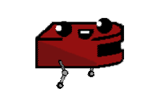
</td>
<td>
  <strong>Ataque a Distancia </strong>
</td>
<td>
<strong>40</strong>
</td>
<td>
<strong>10</strong>
</td>
<td>
<strong>130</strong>
</td>
<td>
<strong>3</strong>
</td>
</tr>
</table>

##### Jugabilidad
Ataca lanzando tostadas a distancia, que hacen daño por contacto con los enemigos.
#### Switchy
Switchy es una consola de una antigüedad parecida a Toasty.

##### Switchy (fase 1)

<table>
<tr>
<td>
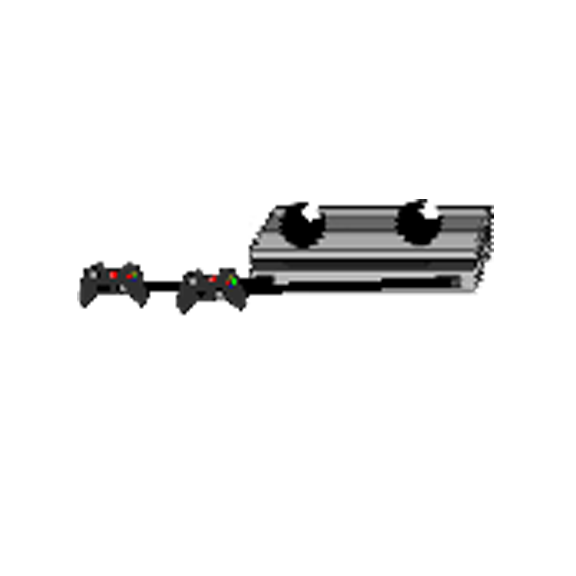
</td>
<td>
  <strong>Switchy fase 1</strong>
</td>
<td>
  <strong>Ataque a Distancia</strong>
</td>
<td>
<strong>40</strong>
</td>
<td>
<strong>7</strong>
</td>
<td>
<strong>130</strong>
</td>
<td>
<strong>3</strong>
</td>
</tr>

</table>

##### Switchy (fase 2)

<table>
<tr>
<td>

</td>
<td>
  <strong> Switchy fase 2</strong>
</td>
<td>
  <strong>Ataque a Melé </strong>
</td>
<td>
<strong>70</strong>
</td>
<td>
<strong>15</strong>
</td>
<td>
<strong>90</strong>
</td>
<td>
<strong>3</strong>
</td>
</tr>             
</table>

##### Historia
Es una consola vieja, con la capacidad de transformarse en un aparato de nueva generación para aumentar sus poderes.

##### Jugabilidad
Al comienzo del gameplay, se encuentra en su 1ª forma. En esta forma, su ataque es a distancia, lanzando discos que hieren a sus enemigos. Para pasar a su segunda forma, se necesita cargar la barra de energí­a. Cuando esta llega a su máximo, entra en la forma evolucionada, en la que su ataque pasa a ser melee, es decir, a poca distancia. Pasado cierto tiempo, vuelve a su forma normal.

### Inanimados
Objetos que son parte del escenario, algunos tienen acciones en determinadas condiciones.

| Sprite                                             | Nombre           | Ratio ideal (en tiles)  | Nota|
| :-------------:                                    | :-------------   |:---:|:----|
| 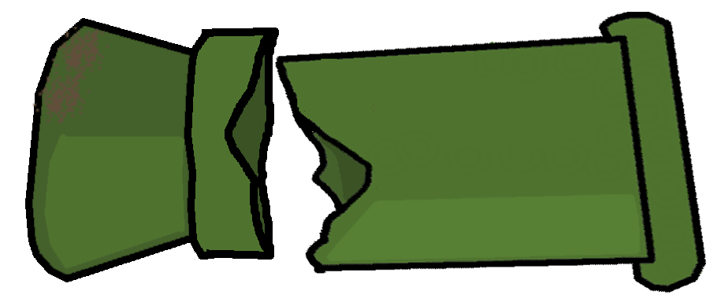   | Tuberia           | 7\*3 |Tiene un parametro|
|    | Nave           | 5\*3 |una nave normal y corriente|
|    | Chatarra           | 3\*2 |Basura corriente|
|    | Agujero           | 1\*1 |Las balas pasan por encima|
|    | Coche           | 3\*1 |un coche rojo|
| 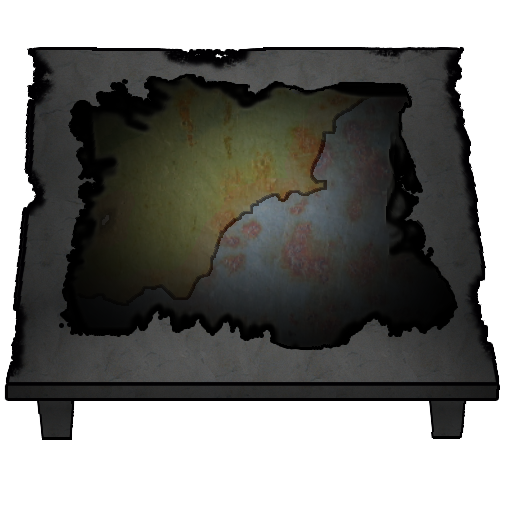   | SelectorZona           | 1\*1 |Solo esta en la base y sirve para selacionar zona|
| 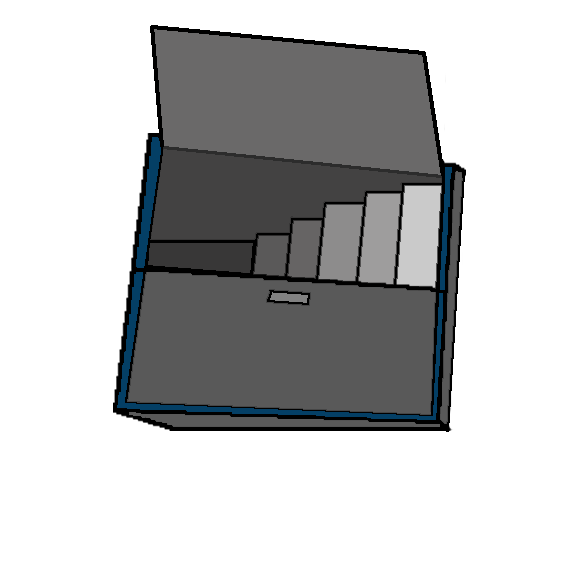   | SelectorPersonaje           | 1\*1 |Solo esta en la base y sirve para cambiar de personaje|
|    | SelectorZona           | 2\*2 |Solo esta en la base y sirve para elaborar nuevos objetos|
|    | SelectorZona           | 3\*1 |Nave que muestra el proceso de reconstrucción de la misma. Tiene diferentes estados.|

### Objetos
#### Consumible
Objetos que se agotan y afectan a las stats del jugador. Los cambios no serán permanentes, solo durarán hasta el final de la run, se gastan en el acto.
Se consiguen matando enemigos o encotrandolos por el mapa.

| Sprite                                             | Nombre           |efecto        |
| :-------------:                                    |:-------------    |:-------------|
|      | Bateria de Coche | maxHP+1, HP+1 |
|      | Pila             | HP+1 |
|      | Cable            | Ve+1 |
|      | Transistor       | At+1 |
|      | Booster       | At+1 |

#### Clave
Estos sirven para craftear otros objetos. Los objetos resultantes pueden ser clave o históricos. Se obtienen encontrándolos en los niveles o, como se ha descrito, por medio de crafteo. Al  terminar satisfactoriamente un nivel o volver a base vivo, almacenaremos los recursos conseguidos en base. Aquí­ es donde se podrá llevar a cabo el crafting.

| Sprite                                           | Nombre           |Uso                | Obtención |
| :-------------:                                  |:-------------    |:-------------     |:---|
|  | Chatarra         | Crafteo           | Enemigos |
| 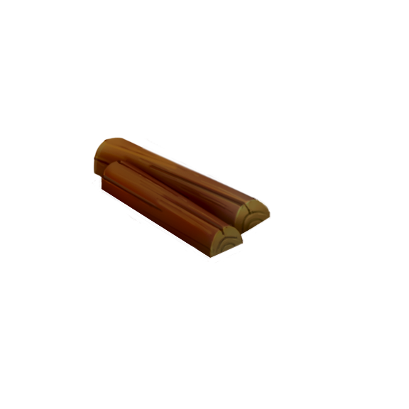 | Madera           | Crafteo           | Enemigos |
|  | Tuercas           | Crafteo           | Enemigos |
|  | Carbón             | Crafteo           | Enemigos |
| 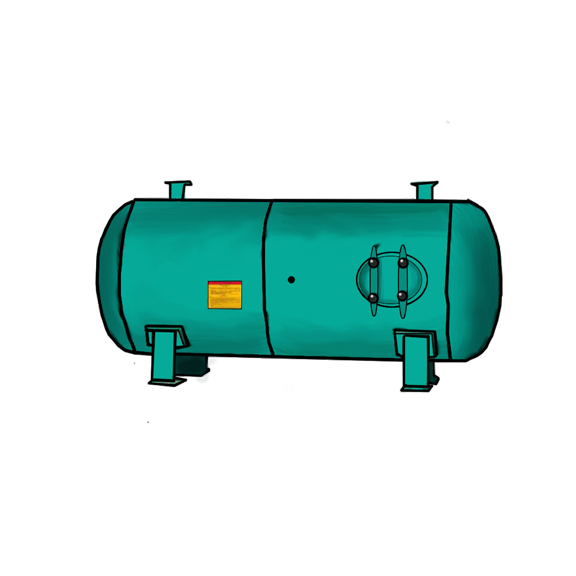 | Tanque            | Crafteo           | Enemigos |
| 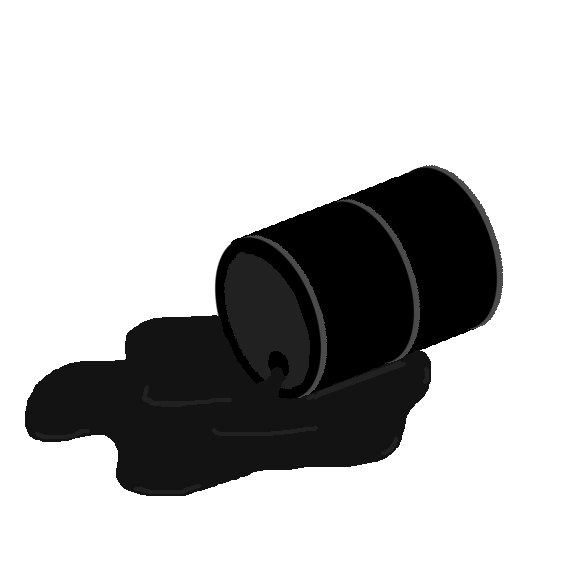 | Petroleo         | Crafteo           | Enemigos |
| 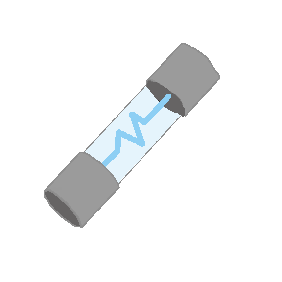 | Fusible           | Crafteo           | Enemigos |
| 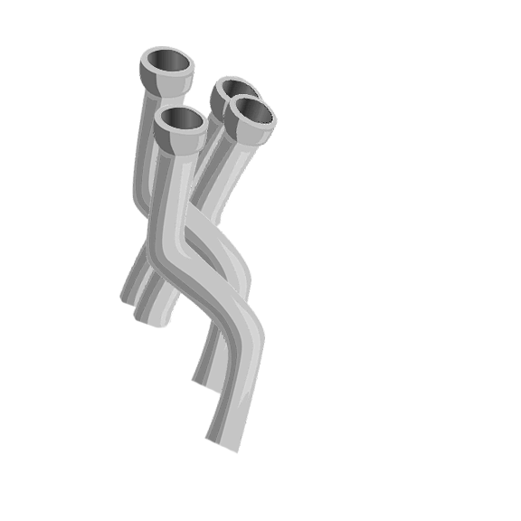 | Tuberí­as         | Crafteo           | Enemigos |
|  | Estaño        | Crafteo           |  Enemigos |
| 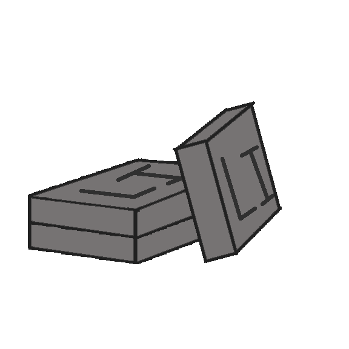 | Litio        | Crafteo           |  Enemigos|
| 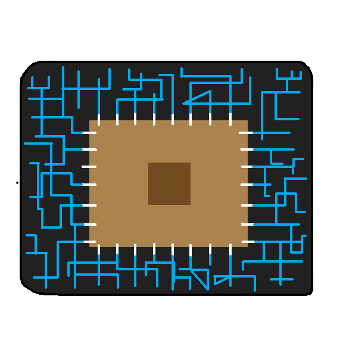 | Chip        | Crafteo           |  Enemigos |
|  | Sensor        | Crafteo           |  Enemigos |
| 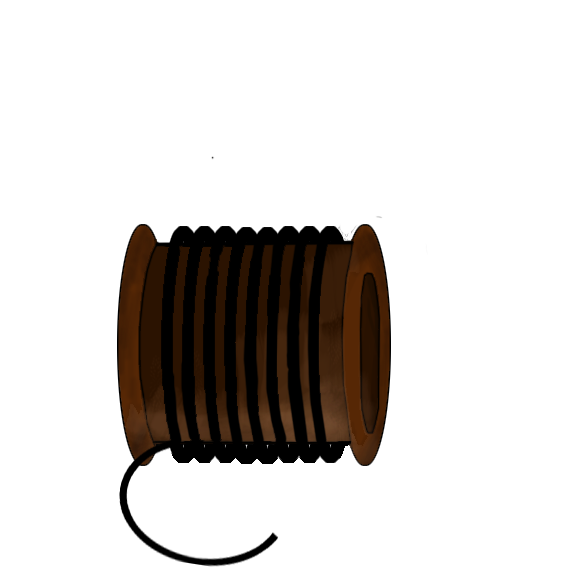 | Carbono              | Crafteo           | Madera + Carbón |
|  | Engranaje        | Crafteo           | Chatarra + Chatarra |
|  | Engranajes       | Crafteo           | Engranaje + Engranaje |
|  | Circuito        | Crafteo           | Chip + Estaño |
| 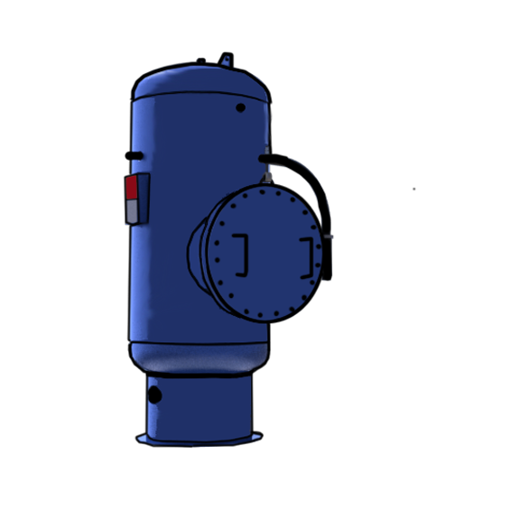 | Tanque a Presión (TP) | Crafteo           | Fusible + Tanque |
| 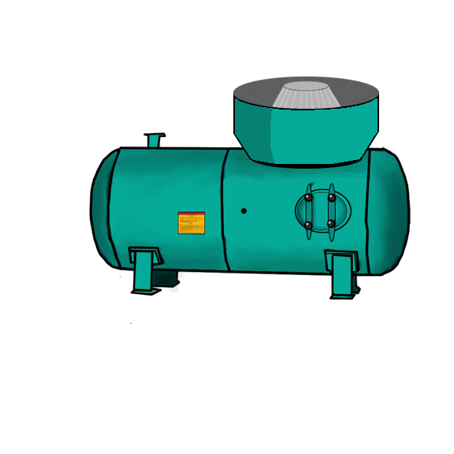 | Refinador Express (RE)     | Crafteo           | TP + Tuberí­as |
| 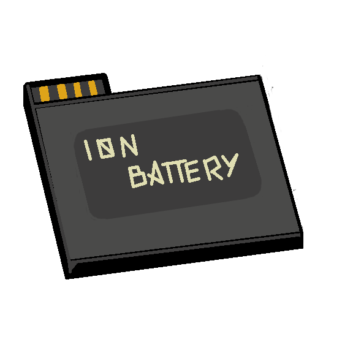 | Baterí­a de iones     | Crafteo           | Estaño + Litio |
|  | Sensor de mov.     | Crafteo           | Chip + Sensor |

#### Histórico
Para el desarrollo de la historia, se craftean o se consiguen matando a jefes.

| Sprite                               | Nombre                 |Obtención        |
| :-------------:                      |:-------------          |:-------------   |
|  | Mecanismo              | Engranajes + Eje + Fusible       |
|   | Circuitos Electronicos | Circuito + Baterí­a de iones + "lo que dropea el 3er boss"        |
|   | Combustible            | RE + Petróleo |
|  | Fibra de carbono                 | Carbono + Tuberí­a |
| 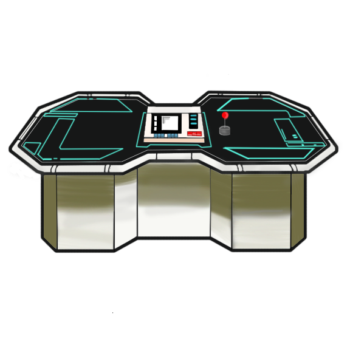 | Módulo de comando                | Chip + Chip + Pantalla |
|  | Pantalla                | Dropea el Boss |
| 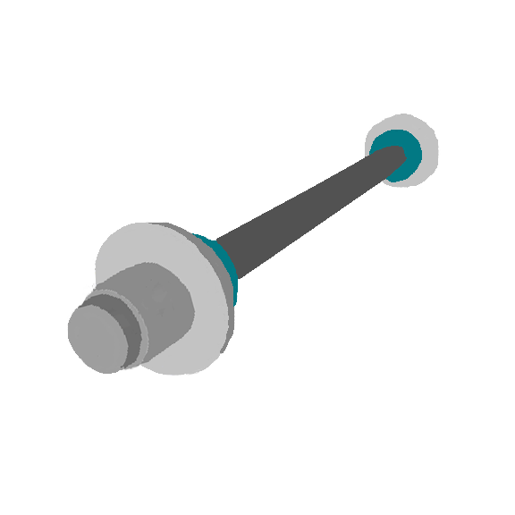 | Eje                | Dropea el Boss |
| 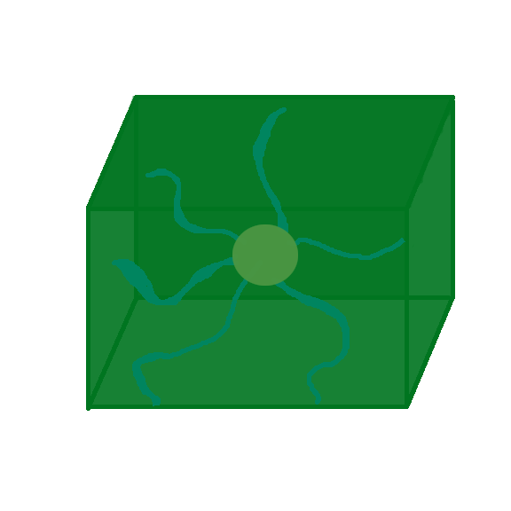 | Nucleo Plasma                | Dropea el Boss |

### NPC's
*Cac = Cuerpo a Cuerpo.*
*At Dist = Ataque a Distancia*

| Sprite                                             | Nombre           |localizaciones    | descripcion | HP | At | Ve | FA |
| :-------------:                                    | :-------------   |:---|:---|:---:|:---:|:---:|:---:|
| 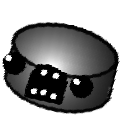     | Roomba          | Desguace | Persigue al jugador y lo hiere cuando lo toca | 30 | 5 | 2.5 | CaC |
| 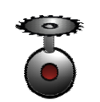     | OV          | Desguace | Vuela y persigue al jugador. Lanza balas. Cuando muere explota lanzando balas. | 20 | 10 | 1.4 | CaC /At Dist |
| 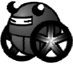     | Boom-Ba          | Desguace | Persigue al jugador y cuando lo toca se hincha y explota | 40 | 20 | 0.3 | CaC (Explosión) |
| 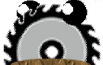     | Sierra          | Desguace | Inmortal. Se mueve en un solo eje de manera constante y hiere al jugador al tocarlo. | Inmortal | 20 | 4.2 | CaC |
|      | Lanza-Tornillos         | Desguace | Enemigo estático de tipo torreta. | 40 | 10 | Estático | At Dist |
| 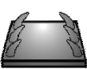     | Trampa Eléctrica         | Desguace | Al colisionar con ella comenzará a hacernos daño durante todo el tiempo que dure el contacto | Inmortal | 5 | 3 | CaC(por colision) |
| 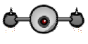     | Dron         | Desguace | Vuela y ataca a distancia | 30 | 10 | 1.6 | CaC/ At Dist |
| 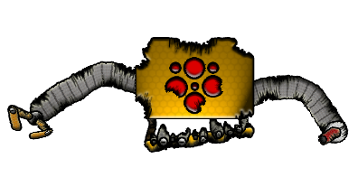     | Carstroller (Boss)          | Desguace | Debajo | HP | At | Ve | FA |
| 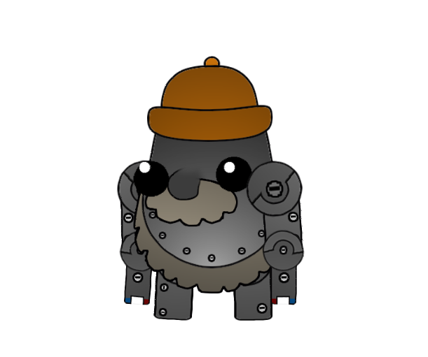     | Gnomo (Boss)          | Desguace | Debajo | 300 | 10 | Estático | FA |
| 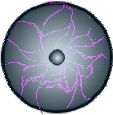     | Gnomo (Boss)          | Desguace | Debajo | 700 | 5 | 2.8 (variable según el estado) | CaC/At Dist |

##### Carstroller
Enemigo jefe que se mueve solamente en el eje X. Está ubicado en la pared norte del nivel.
Ataque:
- 1ª Fase (100-50 vida): alterna dos ataques. Con el primero, lanza coches (proyectil mas grande de lo normal) que tiene apilados detrás suya con el gancho que tiene en la mano derecha; en el segundo, lanza ruedas en tres direcciones durante un breve periodo de tiempo.
- 2ª Fase (50-0 vida): alterna los mismos dos ataques, pero ahora tiene una pistola de aceite. Lanza chorros de aceite que si golpean al jugador, o pasa por el charco que ha creado el disparo, se ralentiza el movimiento del jugador.

##### Gnomo
Enemigo de tipo Jefe que divide su comportamiento en 2 fases:
- 1º Fase (100-50 vida): Efectuará tres ataques: Perseguirá al jugador (si lo toca nos hace daño), lanzará 4 hachas en direcciones N, S, E, O. Si llegan a cierta distancia se dividen en 8 balas., lanza un hacha que rebota dos veces.
- 2º Fase (50-0 vida): Será igual que la 1º fase haciendo un ataque más: Invocará enemigos Sierra que estarán en la escena cierto tiempo.
### Referencias
- The binding of Isaac.
- Enter the gungeon.
- The brave little toaster.

### Agradecimientos
- Universidad Complutense de Madrid.
- Facultad de Informática.

# **Planificación**
## Modelo 1
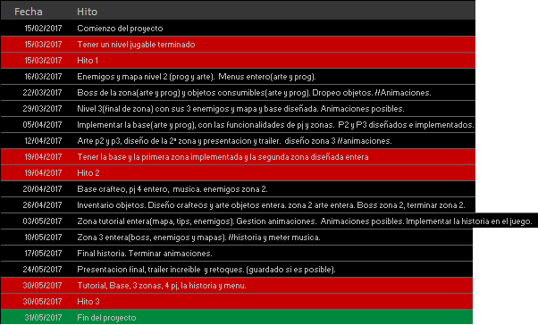

## Línea de Tiempo

## Recta final

# **POST-MORTEM**

## Proyecto

| Nombre | Desarrolladora | Plataforma desarrollo| Duración proceso       |
|:------:|:--------       |:---------------      |:-----------            |
| !Human | Not a Studio   |Visual Studio (C++)   | 11/02/2017 - 31/05/2017|

!Human es un juego TopDown en 2D basado en la acción directa, con componentes de rol desarrollado para Ordenador. En él, nuestro personaje principal ha de enfrentarse a diferentes enemigos para lograr su propósito principal: volver a su nave. Pensado para salir a la venta en la plataforma Steam en el verano de 2017.
## Desarrollo
### Logros
Para empezar a desarrollar los aspectos positivos del proceso, vamos a especificar qué nos ha ido bien.

 Lo más importante y que ya es algo que caracteriza a Not a Studio es la buena conexión que existe entre todos los componentes del estudio. A pesar de estar sometidos en algunos momentos a mucha presión, hemos sido conscientes de que enfadarse o alejarse del resto de compañeros es algo que afectaría negativamente al proyecto. Evidentemente han existido momentos de tensión, pero hemos sabido resolverlos de la forma más cómoda posible para todo el equipo. En general, la comunicación ha sido muy buena y eso ha facilitado mucho el desarrollo.

Una de las cosas que también hemos encontrado mucho más útil y cómoda de lo que nos la esperábamos es la herramienta de control de versiones GitHub. Todos la conocíamos pero prácticamente ninguno sabíamos, al principio del proyecto, manejarnos correctamente con ella. Sin embargo, a base de 'fuerza' hemos aprendido a utilizarla lo suficientemente bien como para que nos facilite mucho el dividir trabajo y no tener miedo de juntar las tareas.
### Problemas
Aquí vamos a definir los principales obstáculos que nos han surgido durante el desarrollo así como las consecuencias que estos han tenido en el mismo.

El principal problema que hemos encontrado ha sido el tiempo. Al comienzo del proyecto, no fuimos conscientes de la importancia de tener unan planificación lo suficientemente concreta como para plantearnos si el tiempo del que disponíamos era suficiente para desarrollar el proyecto. No fuimos conscientes de esto hasta pasado el hito 1.
Esto afectó directamente al juego, ya que tuvimos que recortar varias 'features' para ganar tiempo.

Otro aspecto en el que hemos cometido errores ha sido en el arte. Al comienzo del proyecto, fuimos demasiado optimistas, lanzándonos a crear todo lo referente al estilo del juego(imágenes, música, etc.) por nosotros mismo. Esto produjo que a mitad del desarrollo tuvimos que dejar de lado algunos aspectos de la programación para introducir alguna persona más a la creación de texturas.
Además, también surgieron algunas diferencias en torno al estilo de dibujo que queríamos para el juego. Al final, se solucionó pero esto produjo que no todos los componentes del estudio estuviesen del todo de acuerdo con el resultado.

Algo que tampoco ha funcionado del todo bien es el reparto de tareas. Comenzamos utilizando PivotalTracker para el reparto de las mismas, usando los comienzos de sprint como fecha para asignarlas. Pero como no poseíamos una planificación estricta, han surgido muchos problemas en torno a esto: en ocasiones existían dudas de quién estaba haciendo qué cosa; otras, al no notificar del comienzo/finalización de una tarea, había mas de una persona realizando el mismo trabajo.
Esto va de la mano con la falta de comunicación que existió en algunos momentos. A pesar de haber una buena compenetración entre todos, el no asistir a las reuniones semanales o no utilizar las herramientas de comunicación ha tenido un impacto muy negativo al proyecto.

A parte de todos estos problemas surgidos durante el proceso, también nos hemos encontrado con diferentes desafíos técnicos que nos han relantizado:

 - La inclusión de Box2D en el proyecto por primera vez ha hecho que los desarrolladores que se ocupaban de la programación hayan tenido que ocupar parte de su tiempo para aprender, o al menos intentar, manejar correctamente la librería física. Además, un obstáculo concreto que nos impidió avanzar durante algún tiempo fue un problema surgido a partir de la mala utilización de la librería, pues no entendíamos por qué existía un límite de velocidad que no podíamo superar. Al cabo de algunos días, logramos solucionarlo.
 - La inteligencia artificial de los enemigos también nos ha supuesto un gran bache en el desarrollo. Intentamos por varios caminos implementar el algoritmo 'A*', pero terminamos por descargar esta opción ya que no suponía una gran pérdida de tiempo. Optamos por una IA más sencilla.
### Riesgos
A parte de logros y problemas, han existido ciertos riesgos que hemos tomado y que han dado diferentes resultados.

Por un lado, y como ya se ha descrito anteriormente, el optar por ser totalmente productores del arte del juego ha resultado peor de lo que esperábamos.

Otro riesgo que aceptamos fue utilizar la librería Box2D sin conocimientos previos de la misma. No obstante, supimos arreglar los problemas surgidos a partir de este hecho, de forma que el impacto negativo ha sido el mínimo posible.
### Evaluación del proceso
Aquí vamos ha llevar acabo un pequeño auto análisis más profundo, puntuando cómo de satisfactorios han sido algunos de los aspectos del desarrollo del 1 ( más pobre) al 10 (más satisfactorio):

|Criterio                                | Puntuación   |
|:--------------------------------------:|:-------------|        
|Planificación del proyecto              | 5  |
|Seguimiento de la planificación         | 7|  
|Actuación frente a problemas inesperados| 8|  
|Rendimiento general                     | 7  |
|Comunicación                            | 6  |
|Cooperación como equipo                 | 8 |
|Utilización de los recursos             | 7 |

## Conocimientos adquiridos
Para concluir, vamos a señalar cuáles han sido las mayores lecciones y conocimientos que hemos sacado de todo el proceso así como las consideraciones para siguientes proyectos.

En primer lugar, vamos a señalar cuáles han sido los principales conocimientos adquiridos a través de todo este tiempo en el desarrollo de !Human:

 - Introducción a Box2D, algo que sin duda encontramos muy positivo ya que ahora conocemos muchos aspectos y toda la utilidad de esta librería, por lo que la siguiente vez que decidamo utilizarla será un proceso más familiar y por supuesto más facil
 - Al igual que con Box2D, nuestro manejo en Git y GitHub ha mejorado mucho. Hemos aprendido a, en la medida de lo posible, hacer merges que no dañen la estructura del proyecto.
 - Y por supuesto programación en general y C++ en concreto. El haber utilizado una arquitectura basada en herencia y abstracción ha hecho que aprendamos, a base de prueba y error, cómo utilizar este tipo de estructuración.

A parte de todo esto, también hemos visto qué prácticas y procesos nos han salido bien y cuáles mal.

Por un lado,  el no utilizar un estándar de código ha supuesto que cada vez que alguien tenía que tocar código de otra persona, ésta tenía que preguntar al que ha implementado esa parte para poder entender qué es lo que hace. Como es lógico, esto supuso una gran pérdida de tiempo.

Por el contrario, el realizar las tareas de programación en pareja nos ha resultado muy cómodo y útil, ya que donde uno puede atascarse, el compañero puede resolverlo y ahorrar tiempo.

Por último, algunas de las consideraciones que vamos a tener en cuenta para próximos proyectos son:

- Medir bien la cantidad de arte que necesitamos para el juego, y si es demasiado alta, utilizar material de licencia libre para ahorrar trabajo.
-  Hacer una planificación concreta y realista desde el principio del proyecto, pues nos han surgido muchos problemas
- Junto con la planificación, tener un buen documento de diseño que facilite la implementación de esta planificación.

# **METODOLOGÍAS**
En el desarrollo de este proyecto utilizamos **Scrum**. Para ello, al comienzo del proceso definimos los *sprints*, las fechas de las reuniones y todo lo necesario para seguir un desarrollo cómodo para todos los integrantes.
 Los sprints ocupan una semana de trabajo, y las fechas de comienzo y, por tanto finalización de estos, fueron ubicadas en lunes. Sin embargo, a partir del hito 1 decidimos cambiarlas a miércoles por unanimidad, ya que nos permitía más flexibilidad a la hora de completar las tareas. Así pues, cada miércoles antes de comenzar el reparto de tareas y comenzar a trabajar, tiene lugar una pequeña reunión de los componentes del grupo en los que analizamos el avance de cada uno durante ese sprint. Después de esa breve reunión, se procedía al reparto de tareas para el siguiente sprint. Para ellos, utilizamos **PivotalTracker** como se especifica en el apartado de Herramientas.
## Toma decisiones
La toma general de decisiones sobre las tareas se deposita en las personas que han realizado ese trabajo, ya que lo han hecho según está descrito en la tarea (GDD y PivotalTracker). Es decir, cada avance en el desarrollo del juego es responsabilidad de las personas que han de implementarlo. Ahora bien, toda implementación está expuesta a crítica y evaluación del resto de componentes del estudio. En el caso de no haber concordancia de opiniones entre todos los desarrolladores, la decisión final residirá en las personas que la han implementado.
En cuanto a las decisiones importantes, cómo modificar, quitar o añadir nuevas 'features' al juego, debe llegarse a consenso entre todos los componentes del estudio. Si no se llega a consenso, se lleva a cabo el cambio segun la mayoría de los integrantes  del equipo.
## Modus Operandi
El estudio está conformado actualmente por 8 personas. Para organizarnos y repartir las tareas, utilizamos distintas herramientas:

 1. Skype / Discord: herramientas principales para hablar mientras realizamos tareas fuera de la Universidad, hacer reuniones, etc.

 2. Pivotal Tracker: cada persona tiene una tarea activa en todo momento en Pivotal, de modo que siempre sabe cuál es su trabajo para esa semana. Al comenzar la tarea, hay que notificarlo en la aplicación. Así también, al terminar debemos marcarla como terminada. Los demás componentes del grupo han de evaluarla antes de aceptarla.

 3. Git y GitHub: repositorios en los que se encuentra el proyecto. En el máster en todo momento ha de haber una versión jugable del proyecto, pudiendo existir ramas que estén en desarrollo.
## Tareas especificas
### Diseñar una room
Para diseñar una habitación e implementarla utilizamos Tiled. Al diseñar una Room se han de cumplir estas condiciones para que dicha room sea válida:

 1. El tamaño (tanto del ancho como del alto) ha de ser divisible por dos.
 2. Los tiles centrales de cada lado del nivel han de estar libres, es decir, no pueden estar ocupados por algún tile que no sea de pared normal. Esto permite que se puedan crear las puertas mediante código autáticamente.
 3. Para añadir enemigos, debe crearse una capa de Objetos. Una vez en ella, se crea un rectángulo. A éste se le pone el nombre del PNJ que vayamos a colocar y en el campo Tipo se pone _enemigo_.

### Diseñar un tilesheet
Para diseñar un nuevo tilesheet existe un patrón común que define que cuales de los tiles han de ser colisionables, cuales son de terreno superior y cuales son de terreno normal (por el que podemos desplazarnos.)

# **Arquitectura del proyecto**

La arquitectura está basada en abstracción y herencia, todo lo que tenga una cierta relación viene heredado de una clase superior que contiene el código común, por ejemplo en el caso de la clase Objeto que tiene un Update y Draw a modo de interfaz que luego heredan los objetos y personajes entre otros.
Hemos usado dos librerías externas, SDL y Box2D.
Por ultimo las clases que necesitan introducir un mapa o enemigos usan la clase rapidxml.

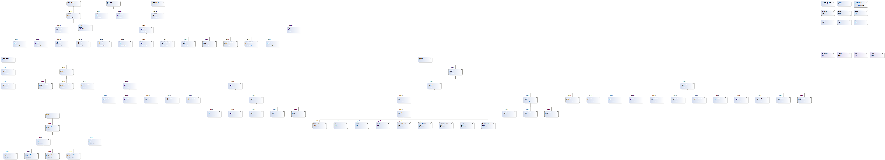

El HUD dividido entre el de juego y el de interaccion de la base
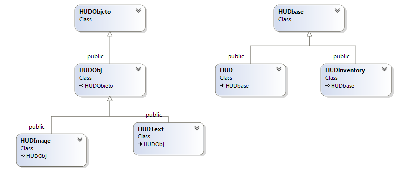
La clase Objeto de donde heredan los personajes, enemigos ,objetos y botones entre otros
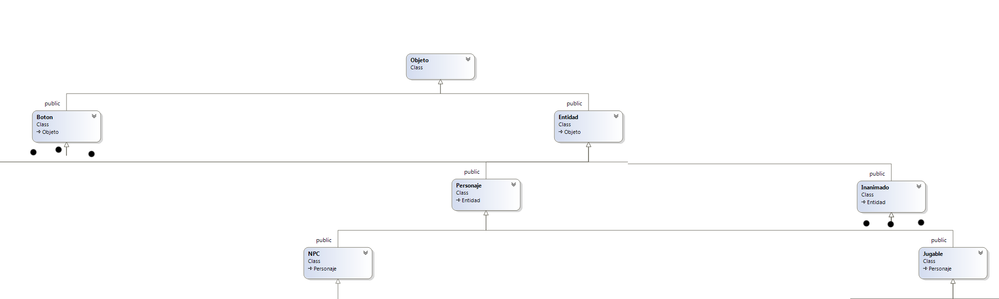
Las diferentes zonas.
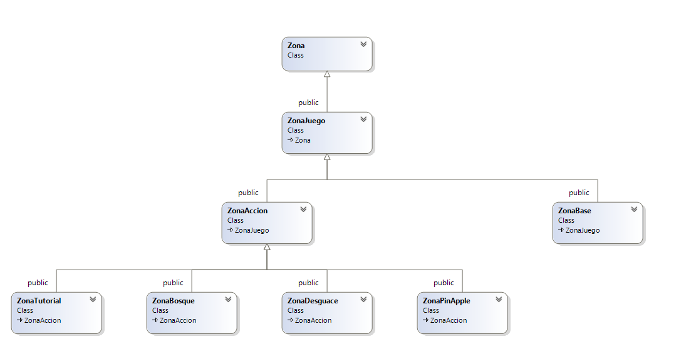
Los estados del juego
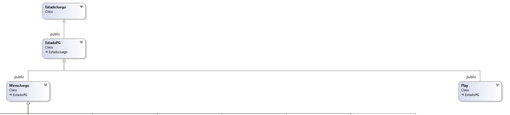

# **Documentación varia**

## Capas de colisiones

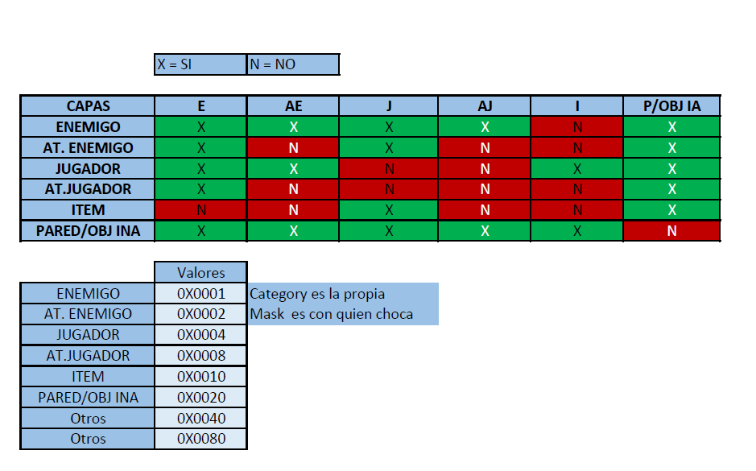

----------

## Bocetos

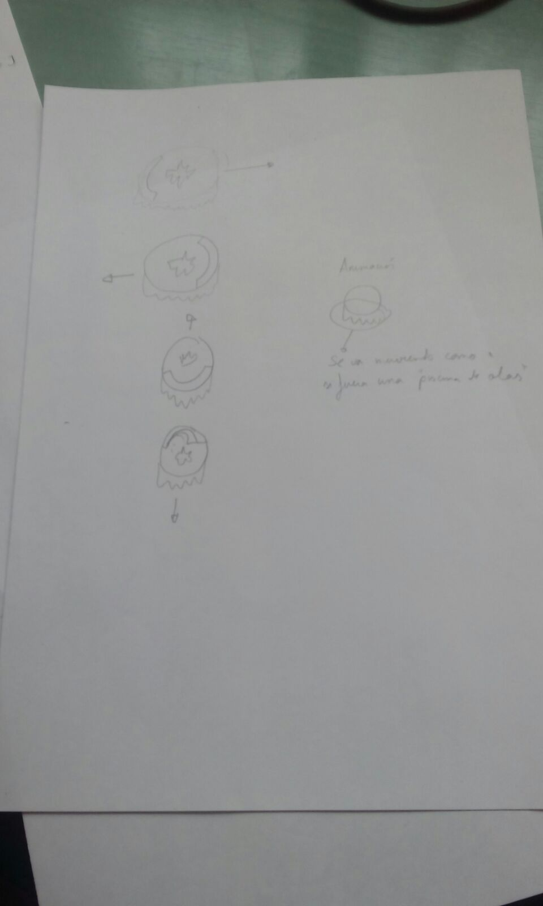

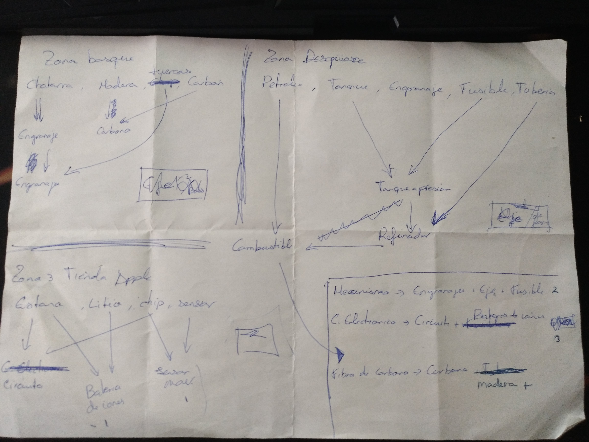

----------
## Guía como hacer un nivel
Guía para crear una habitacion, incluye  objetos del entorno (inanimados/inertes) y enemigos.
### Como diseñar un mapa
Usamos Tiled , para crear mapas metes un tilesheet que este validado, en la carpeta de  tilesheets. Usamos el formato por defecto de Tiled (.tmx), usando el script creado por Fran.
#### Información sobre los tiles
Los primeros 12 tiles (partiendo de 0) no tienen colisión, de ahí en adelante eso tiles tienen colisión.
Al meter los tiles en Tiled esta tiene tiene que ser la configuación 

#### Características de la habitación
- El ancho y el alto tienen que ser múltiplos de 4
- Los siguientes tiles tienen que estar accesibles para el jugador, para no bloquear el acceso a una puerta.(el primer tile es el 0,0).
  - (ancho/2 -1 ,1),(ancho/2 ,1)
  - (ancho/2 -1 ,2),(ancho/2 ,2)
  - (ancho/2 -1 ,alto - 2 ),(ancho/2,alto - 2 )
  - (ancho/2 -1 ,alto - 3 ),(ancho/2,alto - 3 )
  - (ancho - 2 ,alto/2 - 1 ),(ancho - 2,alto/2  )
  - (ancho - 3 ,alto/2 - 1 ),(ancho - 3,alto/2  )
  - (1 ,alto/2 - 1 ),(1,alto/2)
  - (2 ,alto/2 - 1 ),(2,alto/2)
- Las 4 huecos tienen que ser accesibles en todas los mapas ocasiones.

#### Ejemplos
- esta bien este mapa

- la puerta norte es inaccesible

- Tiles prohibidos de usar son usados

### Meter Objetos en el mapa
para poder meter objetos (enemigos o inanimados), se tiene que crear una capa de objetos en el mapa de tiled, según sea enemigo o inanimado tiene que cumplir ciertas condiciones, algunas son comunes.

#### Condiciones
##### Comunes
- Han de tener tipo y nombre. Atributos de un objeto Tiled.
- Los tipos tienen que ser validos y los nombre validos con tipos
- Ejemplos:
  - 
  - 
  - 
  - 

##### Inanimados
- Si un objeto bloquea una puerta, este objeto será eliminado (Los tiles mencionados antes), se borra si esta si se ha generado una puerta si no se borra.
- El Objeto tiene que ser un rectangulo.
- El tipo que hay que poner es inanimado.
- La lista de inanimados esta en el GDD.

##### Enemigos
- Da igual la forma con la que crees el objeto.
- No debe solapar con un inanimado, si no no se genera.
- El tipo que hay enemigo.
- La lista de enemigos esta en el GDD.

----------

## **Post-mortem Hito  1**
### Que si/no ha funcionado
- Ha funcionado el consenso de que iba ir el juego, La idea principal del juego, todo el mundo esta de acuerdo en la idea primitiva del juego.
- No ha funcionado parcialmente el uso correcto del repositiorio tenemos un miedo al merge fallido
- Ha funcionado parcialmente el quedar para hablar por skipe todas las mañanas
- Ha funcionado la distribución de tareas por el Pivotal Tracker.

### Qué hubiera necesitado más detalle
- Si los personajes van a disparar o tener un ataque cuerpo a cuerpo.
- Los Mundos que vamos a tener.
- Los personajes que vamos a hacer.
- Los tipos de enemigos.
- Los objetos que va a haber.
- La herencia de los objetos.

basicamente el GDD no esta definido del todo.

### Qué procesos no han mejorado
- El uso del repositiorio
- Tener algo visible es demasiado complejo a veces

### Qué documentos no se han leido
- El GDD (Muy primitivo de momento para poder hacer algo).
- La herencia de los personajes y de los objetos.

### Qué cambios hacen falta
- Terminar el GDD, al menos en el apartado de las entidades que contiene el juego.
- Hacer la herencia para poder desarrollar contenido.
- Una correcta distribución de tareas.

## **Post-mortem Hito 2**
### Que si/no ha funcionado
- El equipo ha trabajado unido para conseguir acabar los aspectos fundamentales del juego.
- El proyecto al final no ha podido cerrarse como estaba estipulado, teniendo que eliminar algunas caracteristicas del juego.
- El reparto de tareas ha mejorado levemente, siendo mucho más precisos con las tareas y su duración/coste.
- La utilización del repositorio ha mejorado notablemente desde el hito anterior, siendo capaces de gestionar trabajo paralelo gracias a las ramas y a la capacidad de hacer merges sin problemas.
- En ocasiones la comunicación del grupo ha sido ligeramente hostil debido a las situaciones de estrés. Por tanto, ha funcionado parcialmente.

### Qué hubiera necesitado más detalle
- Deberíamos haber prestado mayor atención a la arquitectura general. Al haberse ido haciendo poco a poco y sin mayor planificación de la inicial ha desembocado en una arquitectura un tanto caótica.
- Deberíamos haber sido más precisos a la hora de pedir arte, ya que ha habido ocasiones en que se ha producido arte para ser inmediatamente deshechado.

### Qué procesos no han mejorado
- La unidad del grupo se ha mantenido constante durante todo el proyecto.
- La idea del juego final no se ha cambiado significantemente desde el hito anterior.
### Qué documentos no se han leido
- El GDD (Muy primitivo de momento para poder hacer algo).
- Documento de arquitectura.

### Qué cambios hacen falta
- Previsión mayor de arquitectura del juego.
- Mayor precisión en la planificación general de todo el proyecto.
