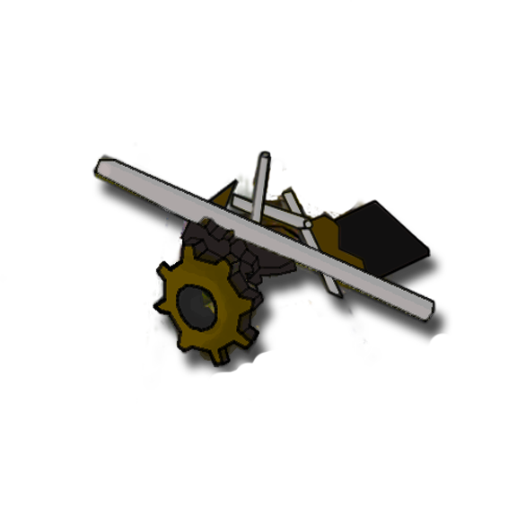
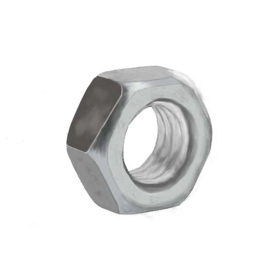
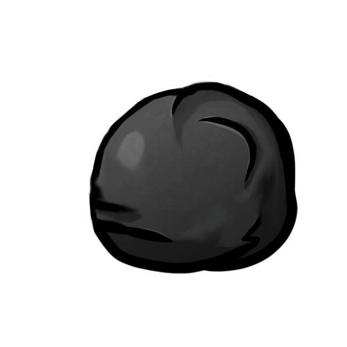
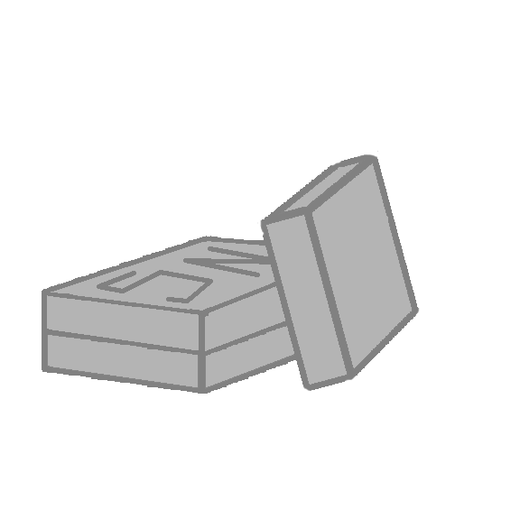
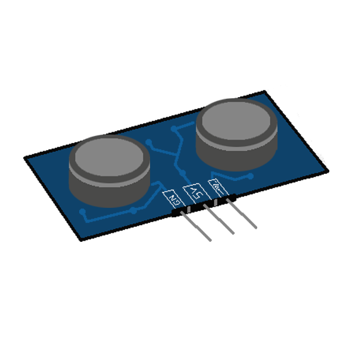
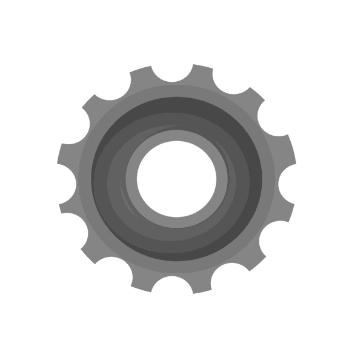
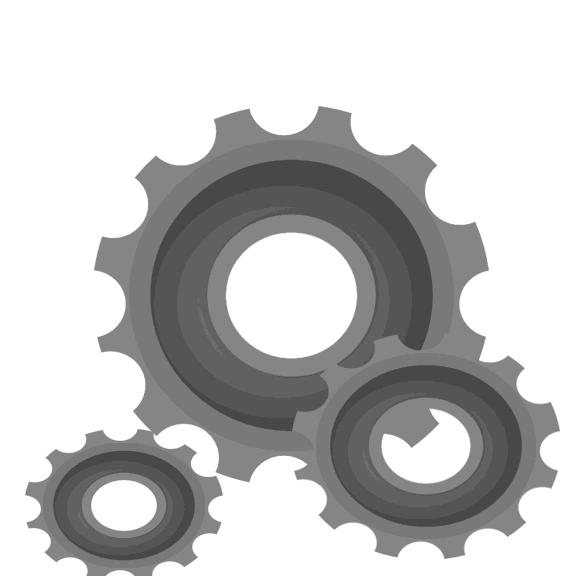
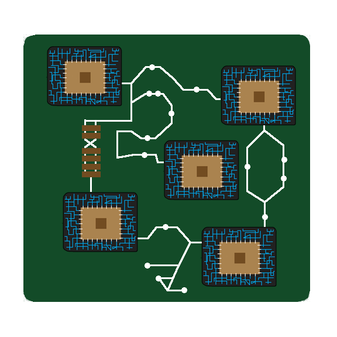
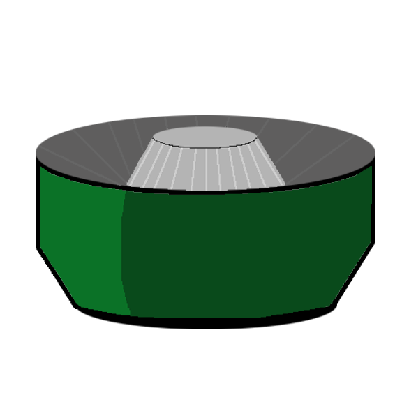
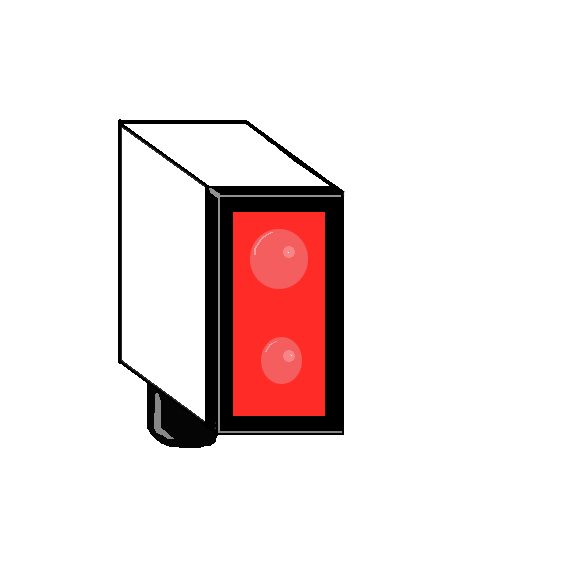

# !Human
## Resumen
| Genero | Público | Modos de juego | Plataforma |
|:-------|:--------|:---------------|:-----------|
| Acción, Rol | Jóven(12 - 30)    |1 Jugador| PC  

##Descripción
!Human es un juego en 2D que mezcla componentes de rol (crafteo de objetos) con la acción directa, que se ubica temporalmente 1000 años mas tarde de nuestra era.  En él, debemos avanzar por distintas zonas con un elenco variado de personajes jugables, máquinas electrónicas de que poseen una IA muy desarrollada. En dichas zonas, debemos derrotar a los enemigos y conseguir recursos para ayudar al personaje principal, Toasty, en su misión por volver a la estación espacial de la que ha caí­do por error a la Tierra para volver junto con su compañero humano "Collin McGuffin", un astronauta residente en la estación. Sin embargo, Toasty ponto se dará cuenta que no todo continúa como cuando el dejó el planeta.
## Portada
portada del juego

## Historia
Año 16DB, Estacion espacial **Shuppatsu** un asteroide colisiona contra la estacion provocando el desprendimiento de uno de los módulos, el cual se precipita sobre la Tierra.
Al estrellarse sobre la superficie terrestre en una pradera aparece entre el humo una tostadora que debido al impacto se ha encendido.
Ésta tostadora fue una de las primeras de su especie, los Companion Devices, también conocidos como CD. Aparatos electrónicos corrientes con una avanzada inteligencia artificial que emulaba emociones para que los astronautas no se sintieran solos en sus trabajos en el espacio. Debido a la complejidad de dicha inteligencia artificial los diseñadores debí­an dividirlas en dos módulos.
Por un lado el módulo de IA **m-4N** que estaba diseñado para poder desarrollar una inteligencia emocional, emulación de emociones y comunicación con humanos progresiva simulando la compañí­a humana. Por otro lado el módulo **g-0D** era el encargado de las respuestas motoras y control sobre el aparato en sí­. 

Pero llegado un momento, la gran cantidad de CDs sobre la tierra sumada a la escasez energética que sufría la tierra ocasiona la retirada de servicio de los CDs, cuyo gasto energético es muy alto. Durante esta retirada, en la estación espacial, el astronauta Collin McGuffin decide esconder a su amigo Toasty en un modulo de rescate para que no se lo llevaran con la promesa de volver a encenderlo cuando todo pasara. Ese es el último recuerdo de nuestro personaje, justo antes de despertarse desorientado en la superficie de la tierra, sin saber que hacer.

Toasty deberá abrirse paso a través de una tierra poco parecida a la que le había descrito su amigo Collin, repleta de CDs malignos que intentarán robar su energía, para conseguir las piezas necesaria para llegar de nuevo a la estación espacial y reencontrarse con su amigo. Pero ésto no lo hará sólo, pues durante su viaje se le unirán amigos que, igual que él, buscan sobrevivir en un mundo desolado y violento.

## 5 Primeros minutos del Juego
Durante los primeros momentos del juego, se realiza una especie de tutorial en la que el jugador va aprendiendo poco a poco las mecánicas básicas del juego: movimiento, ataque, recolección de items, crafteo, etc.
Al iniciar el tutorial, el jugador aparece con Toasty en medio de un lugar inhóspito. Se le muestra un primer mensaje que muestra como mover a Toasty. A medida que avanza por el nivel, se le irá dando instrucciones básicas para que se familiarice con el gameplay del juego: movimiento, ataque, objetos... A mitad del nivel, aparecerá el primer enemigo, un perseguidor. Con él, el jugador pondrá en práctica las mecánicas enseñadas anteriormente. A continuación, el jugador volverá a toparse con una serie de enemigos, diferentes al perseguidor. Momentos antes de llegar al fin del nivel, el jugador se encuentra con un objeto junto con un mensaje que informa al jugador sobre el sistema de almacenamiento de objetos durante el juego. Finalmente, el jugador saldrá del nivel y será llevado a la Base.
Éste es el lugar en el que se administran todos los aspectos del juego, y para ello cada objeto interactivo en la base contiene una descripción que provee de conocimientos al jugador para que sepa utilizar todos ellos.  

## Jugabilidad
### Mecánica
####Movimiento
Movimiento en 8 direcciones con las teclas WASD. La velocidad de desplazamiento dependerá del atributo correspondiente del personaje. 
####Ataque
En cuanto al ataque, se ejecuta con las teclas de dirección. Existen varias formas de ataque que dependen del personaje jugable que hayamos seleccionado para jugar:

- Ataque a melee: ataque a corta distancia que puede realizarse en 4 direcciones. Su rango dependerá del personaje seleccionado.

- Ataque a distancia: el personaje lanza proyectiles que recorren el nivel hasta impactar con algo o llegar a su máximo rango, que dependerá de los atributos del personaje.
####Creación de objetos
Durante el juego, iremos recogiendo objetos que se almacenarán en nuestro inventario. Para abrir el inventario y observar los materiales que hemos recogido hasta el momento, utilizamos la tecla I.
Una vez en la base, para guardar todos estos objetos en el baúl pulsamos la tecla T y se almacenan automáticamente en él.

### Dinámica
El juego tiene 2 partes correlacionadas. Una parte arcade, en la que lucharemos contra los CDs en la tierra y conseguiremos piezas mecánicas y la segunda, una parte de supervivencia/elaboración en la que, con esas piezas, fabricaremos componentes que nos servirán para completar la nave.

#### Elaboración de objetos
Esta parte de la dinámica es la que hace avanzar directamente la historia o desarrollo del juego y se desarrolla en Refugio/Base. Tiene que ver con desbloqueo de piezas para la Nave. El objetivo principal de esta parte es conseguir los objetos necesarios para construir la nave al completo y así poder escapar.

####Arcade
Se desarrolla en las habitaciones. Éstas están repletas de enemigos que intentarán frenar nuestra misión. Si conseguimos eliminar a todos, se abrirán las puertas que nos permiten acceder a la siguiente.

Al morir, los enemigos pueden dejar en el suelo una gran variedad de objetos: algunos consumibles que aumentan las estadísticas de nuestro personaje durante esa partida (hasta volver a base) y otros que nos servirán como materiales para fabricar las piezas de la nave.

Si nosotros somos derrotamos, moriremos todos los objetos que hayamos recolectado hasta el momento. Para evitar esta pérdida de inventario, existirán habitaciones durante la zona que nos permitirán volver a base sanos y salvos con nuestros objetos, pero nos impedirán llegar al final de la zona.
 
Al final de cada zona, nos enfrentaremos a un enemigo de una dificultad mayor al resto: el __boss__ de ese lugar. Si conseguimos derrotarlo, éste soltará una tarjeta SD con la que obtendremos más información sobre el contexto y la historia de !Human. Además, se abrirá la puerta a otra habitación que nos permitirá volver a base con todos nuestros objetos.
### Estética
Modelo top-down. Cartoon. Estética desenfadada.
## Menús
### Inicio
Menú que se muestra al iniciar el juego, desde el que podemos acceder al juego directamente (entraremos en la base), ir al menú de opciones o salir del juego.
###Opciones
Aquí podremos bajar y subir el volumen del juego y volver al menú anterior
### Pausa
Durante el juego, podemos pulsar 'ESC' para acceder al menú de pausa, que detendrá el juego y nos mostrará dos opciones: Reanudar el juego o salir de él (se volverá a la base y se perderán los avances en el nivel).
###Game Over
Cuando el jugador muere, se muestra éste menú que únicamente nos permite volver a base.
## Localidades
### La Base o Refugio
Aquí no podremos realizar ataques, ya que no existirán enemigos. Será un único nivel, pero estará dividido por secciones. Para poder realizar las diferentes acciones disponibles en la base, el jugador ha de acercarse al objeto correspodiente. Así, podremos:

- Elegir zona para jugar: se despliega un mapa en el que podemos ver la localización de las diferentes zonas y elegir a la que queramos ir. Al seleccionar una de las zonas, aparecemos en un nivel preparados para la acción.
- Elaborar componentes: desde aquí, podemos ver los objetos que tenemos almacenados en el baúl. Por otro lado, tendremos la posibilidad de elaborar nuevos objetos a partir de los que ya poseemos. 
- Elegir personaje: para cambiar entre Toasty y Switchy, podemos seleccionar uno de los dos. Una vez seleccionado, pasaremos a controlar dicho personaje.

- Leer las tarjetas SD: para poder acceder a la información de las tarjetas recogidas, podemos reproducirlas desde el Ordenador. 

El guardado se realizará automaticamente al entrar a la base al volver de una zona o al salir del juego si estás en la base.
### Zonas
Las zonas son las partes jugables del juego. Estás se dividen en niveles/habitaciones, que es donde realmente sucede la acción. Una zona tiene las siguientes caracterí­sticas:

-  Compuesta de varios niveles o habitaciones.
- Las zonas siguen el siguiente orden de niveles:
	- El primer nivel es un nivel base, en el que no hay enemigos, objetos etc. Sólo el jugador.
	- Después, habrá  X niveles en los que sí­ habrá NPC's y que comparten dificultad. Al superar esos X niveles, habrá una habitación en la que no existirán enemigos. En esta habitación (neutra) podremos volver a base sin perder nuestros recursos, o continuar otros X niveles con un aumento de dificultad.
- Existe un nivel final con un boss particular. 
- Hay 3 tipos de recursos por zona: Recursos genéricos (comunes entre las diferentes zonas), recursos especí­ficos de cada zona y el recurso que da el boss.
- La forma de colocar habitaciones es pseudo-aleatoria.
- Enemigos diferentes por zona, puediendo existir enemigos "comunes" a todas las zonas.
- Tilesheets propio por zona, que definirá la estética de sus niveles, que lógicamente será la misma.

#### The Natural Preserve (Zona Tutorial)
Un bosque de chatarra, es la primera zona que tienes al comenzar el juego. Aquí aprenderemos lo básico sobre cómo jugar.
#### Hipsters Sancturary
Una PinApple Store, es la segunda zona que se desbloquea, se desbloquea cuando se craftea los engranajes.
#### Several Motors Museum
Un Desguace.
#### Beautiful Refinery
Hornos

### Habitaciones/Niveles
Como se ha mencionado antes, los niveles son donde sucede la acción. Los niveles se caracterí­zan por:

- Tener un escenario, compuesto por objetos que dan profundidad al nivel. Los objetos pueden ser mera decoración o interactuables, como cofres.
- Tener enemigos. No obstante, pueden existir niveles que no tengan enemigos pero que la propia disposición del escenario suponga un desafí­o para superarlo.
- Hay X variantes de una misma habitación.
- Estar conectada minimo a otra habitación.
- Hasta que no se ha acabado con todos los enemigos, no se podrá avanzar al siguiente nivel.(?)
- Poder regresar a la base durante él, pero se perderá el progreso en la zona, es decir, se empezará desde el primer nivel al volver a jugar la zona.

## Personajes

| Sprite                                             | Nombre           | Nota | HP | At | Ve | FA |
| :-------------:                                    | :-------------   |:---|:---:|:---:|:---:|:---:|
| imagen del personaje                             | Nombre | Tipo de Ataque | vida maxima | ataque | velocidad | vel.ataque  |

### Toasty

|    | Toasty           | Ataque a Distancia | 40 | 10 | 130 | 3 |
| :-------------:                                    | :-------------   |:---|:---:|:---:|:---:|:---:|

#### Forma de desbloqueo
Personaje principal de la historia es una tostadora.
#### Jugabilidad
Ataca lanzando tostadas a distancia, que hacen daño por contacto con los enemigos.

### Switchy (fase 1)

|    | Toasty           | Ataque a Distancia | 40 | 7 | 130 | 3 |
| :-------------:                                   | :-------------   |:---|:---:|:---:|:---:|:---:|

### Switchy (fase 2)

|    | Toasty           | Ataque a Distancia | 70 | 15 | 90 | 3 |
| :-------------:                                    | :-------------   |:---|:---:|:---:|:---:|:---:|

#### Forma de desbloqueo
??

#### Historia
Es una consola vieja, con la capacidad de transformarse en un aparato de nueva generación para aumentar sus poderes.

#### Jugabilidad
Al comienzo del gameplay, se encuentra en su 1ª forma. En esta forma, su ataque es a distancia, lanzandos discos que hieren a sus enemigos. Para pasar a su segunda forma, se necesita cargar la barra de energí­a. Cuando esta llega a su máximo, entra en la forma evolucionada, en la que su ataque pasa a ser melee. Pasado X tiempo, vuelve a su forma normal.

## Inanimados
Objetos que son parte del escenario, algunos tienen acciones en determinadas condiciones.

| Sprite                                             | Nombre           | Ratio ideal (en tiles)  | Nota|
| :-------------:                                    | :-------------   |:---:|:----|
|    | Tuberia           | 7\*3 |Tiene un parametro|
|    | Nave           | 5\*3 |una nave normal y corriente|
|    | Chatarra           | 3\*2 |Basura corriente|
|    | Agujero           | 1\*1 |Las balas pasan por encima|
|    | Coche           | 3\*1 |un coche rojo|
|    | SelectorZona           | 1\*1 |Solo esta en la base y sirve para selacionar zona|

## Objetos
### Consumible
Objetos que se agotan y afectan a las stats del jugador. Los cambios no serán permanentes, solo durarán hasta el final de la run, se gastan en el acto.
Se consiguen matando enemigos o encotrandolos por el mapa.

| Sprite                                             | Nombre           |efecto        |
| :-------------:                                    |:-------------    |:-------------|
|      | Bateria de Coche | maxHP+1, HP+1 |
|      | Pila             | HP+1 |
|      | Cable            | Ve+1 |
|      | Transistor       | At+1 |

### Clave
Estos sirven para craftear otros objetos. Los objetos resultantes pueden ser clave o históricos. Se obtienen encontrándolos en los niveles o, como se ha descrito, por medio de crafteo. Al  terminar satisfactoriamente un nivel o volver a base vivo, almacenaremos los recursos conseguidos en base. Aquí­ es donde se podrá llevar a cabo el crafting.

| Sprite                                           | Nombre           |Uso                | Obtención |
| :-------------:                                  |:-------------    |:-------------     |:---|
|  | Chatarra         | Crafteo           | the Natural Preserve |
|  | Madera           | Crafteo           | the Natural Preserve |
|  | Tuercas           | Crafteo           | the Natural Preserve |
|  | Carbón             | Crafteo           | the Natural Preserve |
|  | Tanque            | Crafteo           | S.Motors Museum |
|  | Petroleo         | Crafteo           | S. Motors Museum |
|  | Fusible           | Crafteo           | S. Motors Museum |
|  | Tuberí­as         | Crafteo           | S. Motors Museum |
|  | Estaño        | Crafteo           |  Hipsters Sanctuary |
|  | Litio        | Crafteo           |  Hipsters Sanctuary |
|  | Chip        | Crafteo           |  Hipsters Sanctuary |
|  | Sensor        | Crafteo           |  Hipsters Sanctuary |
|  | Carbono              | Crafteo           | Madera + Carbón |
|  | Engranaje        | Crafteo           | Chatarra + Chatarra |
|  | Engranajes       | Crafteo           | Engranaje + Engranaje |
|  | Circuito        | Crafteo           | Chip + Estaño |
|  | Tanque a Presión (TP) | Crafteo           | Fusible + Tanque |
|  | Refinador Express (RE)     | Crafteo           | TP + Tuberí­as |
|  | Baterí­a de iones     | Crafteo           | Estaño + Litio |
|  | Sensor de mov.     | Crafteo           | Chip + Sensor |

### Histórico
Para el desarrollo de la historia, se craftean o se consiguen matando a jefes.

| Sprite                               | Nombre                 |Obtención        |
| :-------------:                      |:-------------          |:-------------   |
|  | Mecanismo              | Engranajes + Eje + Fusible       |
|   | Circuitos Electronicos | Circuito + Baterí­a de iones + "lo que dropea el 3er boss"        |
|   | Combustible            | RE + Petróleo |
|  | Fibra de carbono                 | Carbono + Tuberí­a |
|  | ¿?                | Derrotando al 1er boss |
|  | Eje                 | Derrotando al 2º boss |
|  | ¿?                | Derrotando al 3er boss |

### Piezas de Nave
Objetos que nos permitiran terminar nuestra nave averiada y volver al espacio.
| Sprite                               | Nombre                 |Obtención        |
| :-------------:                      |:-------------          |:-------------   |
||   | Motor principal           | 4 engranajes + 2 baterí­as de iones |
|  | Acelerador                 | 2 mecánismos + 1 circuito electrónico |
|  | Módulo de comandos                | 3 circuito electrónicos + 1 fibra de carbono|
|  | Estabilizador                 | 4 sensores de mov. + 1 mecanismo |

## NPC's

| Sprite                                             | Nombre           |localizaciones    | descripcion | HP | At | Ve | FA |
| :-------------:                                    | :-------------   |:---|:---|:---:|:---:|:---:|:---:|
|      | Roomba          | Desguace | Debajo | HP | At | Ve | FA |
|      | OV          | Desguace | Debajo | HP | At | Ve | FA |
|      | Boom-Ba          | Desguace | Debajo | HP | At | Ve | FA |
|      | Sierra          | Desguace | Debajo | HP | At | Ve | FA |
|      | Lanza-Tornillos         | Desguace | Debajo | HP | At | Ve | FA |
|      | Trampa Eléctrica         | Desguace | Debajo | HP | At | Ve | FA |
|      | Carstroller (Boss)          | Desguace | Debajo | HP | At | Ve | FA |
|      | Gnomo (Boss)          | Desguace | Debajo | HP | At | Ve | FA |

#### Carstroller
Enemigo jefe que se mueve solamente en el eje X. Está ubicado en la pared norte del nivel.
Ataque:
- 1ª Fase: alterna dos ataques. Con el primero, lanza coches (proyectil mas grande de lo normal) que tiene apilados detrás suya con el gancho que tiene en la mano derecha; en el segundo, lanza ruedas en tres direcciones durante un breve periodo de tiempo.
- 2ª Fase: alterna los mismos dos ataques, pero ahora tiene una pistola de aceite. Lanza chorros de aceite que si golpean al jugador, o pasa por el charco que ha creado el disparo, se ralentiza el movimiento del jugador.

## Referencias
- The binding of Isaac.

- Enter the gungeon.

## Agradecimientos
- Special Superextra thanks to Hideo Kojima
